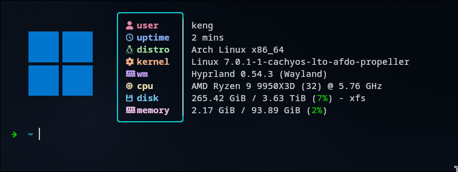

# Compile AutoFDO Kernel

- `docker compose run --rm kernel-autofdo`

# Install AutoFDO Kernel & Reboot

- `sudo pacman -U --overwrite '*' ./out/autofdo/linux-cachyos*.pkg.tar.zst`
- config your bootloader
- reboot to autofdo kernel

# Prepare AutoFDO

- `sudo sh -c "echo 0 > /proc/sys/kernel/kptr_restrict"`
- `sudo sh -c "echo 0 > /proc/sys/kernel/perf_event_paranoid"`
- `docker compose build autofdo-collector`

# Workload AutoFDO

- burn your CPU around 20 mins
- **while burning** run `docker compose run --rm autofdo-collector`

# Compile Propeller Kernel

- `docker compose run --rm kernel-propeller`

# Install Propeller Kernel & Reboot

- `sudo pacman -U --overwrite '*' ./out/propeller/linux-cachyos*.pkg.tar.zst`
- config your bootloader
- reboot to propeller kernel

# Prepare Propeller

- `sudo sh -c "echo 0 > /proc/sys/kernel/kptr_restrict"`
- `sudo sh -c "echo 0 > /proc/sys/kernel/perf_event_paranoid"`
- `docker compose build propeller-collector`

# Workload Propeller

- burn your CPU around 20 mins
- **while burning** run `docker compose run --rm propeller-collector`

# Create Config

- `docker compose run --rm kernel-config`

# Compile Kernel

- `docker compose run --rm kernel-builder`

# Prepare Installation

- update `/etc/mkinitcpio.d/linux-cachyos-lto-afdo-propeller.preset` add `default_options="-S autodetect"`

# Installation

- `sudo pacman -U --overwrite '*' ./out/linux-cachyos-lto-afdo-propeller*.pkg.tar.zst`

# Clean up profiler

- `sudo pacman -Rns linux-cachyos linux-cachyos-headers linux-cachyos-dbg linux-cachyos-nvidia-open`